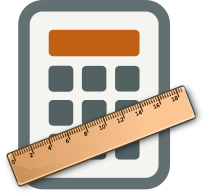

# Android Asset Dimension Calculator 
Easily calculate the dimensions of drawables at various pixel densities.

## Basic Overview
When creating assets to support different screen sizes and pixel densities on Android it's helpful to know the width and height needed for every size you'll need to export. This tool takes the width, height, and original pixel density of your base asset, then calculates the width and height at every other pixel density. The scaling is determined by the suggested  **scaling factors** in the [Android documentation.](https://developer.android.com/training/multiscreen/screendensities#TaskProvideAltBmp)

## Usage
```
python3 scaling_calculator.py -h

python3 scaling_calculator.py <width> <height> [-d | --density <density-prefix>]
```

### Required Parameters
width: the width of your base asset<br/>
height: the height of your base asset

### Options
-h<br/> 
&nbsp;&nbsp;&nbsp;&nbsp;&nbsp;&nbsp;Display a summary of commands.<br/>
-d, --density<br/>
&nbsp;&nbsp;&nbsp;&nbsp;&nbsp;&nbsp;The prefix of the base pixel density; must come from the set {l, m, h, xh, xxh, xxxh}. The default is **m**.

## Examples
Suppose you are using Inkscape to design a logo in the SVG format for a medium pixel density (mdpi) phone with a resolution of **360 x 640**. Your logo ends up being **270.841 x 103.693**, and you need to export this as a PNG at every pixel density. To calculate the dimensions:

```
python3 scaling_calculator.py 270.841 103.693
```

Since medium density (mdpi) is the default, the ```--density``` option isn't needed. This results in the output:

```
ldpi:
  w=203
  h=78
mdpi:
  w=271
  h=104
hdpi:
  w=406
  h=155
xhdpi:
  w=542
  h=208
xxhdpi:
  w=813
  h=311
xxxhdpi:
  w=1083
  h=415
```

It shows the scaled width and height in pixels at each density. Note that the original pixel density (mdpi) is still shown since it displays the final results in pixels.
<br/>
<br/>
If you instead design your logo for xhdpi with the dimensions **595.352 x 247.849**, then simply pass **xh** for the density option:

```
python3 scaling_calculator.py 595.352 247.849 -d xh
```

Giving the ouput:
```
ldpi:
  w=223
  h=93
mdpi:
  w=298
  h=124
hdpi:
  w=447
  h=186
xhdpi:
  w=595
  h=248
xxhdpi:
  w=893
  h=372
xxxhdpi:
  w=1191
  h=496
```